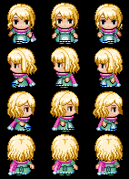

<h1> Jasmin Character </h1>
<table>
  <tr>
    <th><b>Face Art</b></th>
    <th><b>Sprites</b></th>
  </tr>
  <td></td>
  <td></td>
</table>
<ul>
<li><b>Nome:</b> Jasmin Kennedy</li>  
<li><b>Idade:</b> 30 Anos </b></li>  
<li><b>Gostos:</b> Jasmin tem um interesse profundo em estudos antigos e mistérios, especialmente relacionados a civilizações antigas </li>  
<li><b>Origem:</b> Jasmin nasceu na Seita Croatoan, um grupo com crenças obscuras. Apesar de ter uma inteligência notável, ela discordava das práticas da seita. No entanto, quando atingiu a maioridade, foi controlada pelos efeitos da Pedra de Croatoan, tornando-se uma das líderes da seita. Aos 19 anos, como Grã-Mestra, ela elaborou um plano para trazer o deus da seita ao mundo, usando o poder da pedra. Para garantir o sucesso do plano, ela apagou parte de suas memórias, mas deixou pistas para que sua verdadeira história fosse descoberta. Durante suas viagens, ela conheceu Jhonny Kennedy, por quem se apaixonou genuinamente. Mais tarde, ao recuperar as memórias, Jasmin ficou dividida entre seu amor por Jhonny e seu compromisso com a seita.</li>  
<li><b>Trabalho:</b> Jasmin é uma arqueóloga formada e possui seu próprio escritório de arqueologia. Além disso, ela é secretamente a líder da Seita Croatoan, que agora detém a Pedra de Croatoan, também conhecida como Coração de Croatoan.</li>  
<li><b>Personalidade:</b> Jasmin é uma pessoa calma, por vezes brincalhona e cheia de animação. Ela tem uma personalidade animada, mas nos momentos mais sérios, sua verdadeira natureza desesperada pode emergir.</li>  
<li><b>Família:</b> Jasmin é casada com Jhonny Kennedy. Além disso, sua relação com a seita Croatoan pode implicar que membros da seita se considerem uma espécie de "família" de crença.</li>  

</ul>

