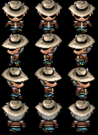

<h1> Morgana Character </h1>
<table>
  <tr>
    <th><b>Face Art</b></th>
    <th><b>Sprites</b></th>
  </tr>
  <td></td>
  <td></td>
</table>
<ul>
<li><b>Nome:</b> Jhonny Kennedy</li>  
<li><b>Idade:</b> 28 anos </b></li>  
<li><b>Gostos:</b> Jhonny tem um interesse particular por histórias, especialmente as de terror. Sua exposição a essas narrativas o tornou apático em relação ao medo da morte. </li>  
<li><b>Origem:</b> Jhonny nasceu em uma família de origem humilde. Aos 16 anos, saiu de casa e passou a viver como um pistoleiro, trabalhando como caçador de recompensas. Sua vida não foi fácil, e ele desenvolveu dificuldades em confiar nas pessoas, bem como uma constante sensação de insegurança ao seu redor. Aos 20 anos, casou-se pela primeira vez, mas o casamento não durou muito, pois suas experiências anteriores afetaram sua capacidade de confiar plenamente. No entanto, aos 23 anos, ele conheceu Jasmin, sua atual esposa, em um bar. Ela se tornou a pessoa em quem Jhonny confia profundamente. Com a ajuda dela, ele se formou e agora trabalha como explorador ao lado de Jasmin, que é uma arqueóloga e praticamente dona da empresa para a qual eles trabalham.
</li>  
<li><b>Trabalho:</b> Ex-pistoleiro, Jhonny agora é um explorador, acompanhando arqueólogos em suas descobertas. Ele se aventura em locais perigosos para comprovar os estudos e pesquisas dos arqueólogos.</li>  
<li><b>Personalidade:</b> Jhonny é calmo, mas também carrega uma melancolia e insegurança constantes. Ele frequentemente se lembra do passado, o que influencia sua maneira de encarar o presente.</li>  
<li><b>Família:</b> O status de seu pai e mãe é desconhecido. Ele é casado com Jasmin, a única pessoa em quem Jhonny confia plenamente e por quem ele estaria disposto a dar sua vida.</li>  
<li><b>Habilidades:</b> Habilidade com facas e armas de fogo</li>
