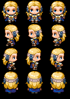

<h1> Morgana Character </h1>
<table>
  <tr>
    <th><b>Face Art</b></th>
    <th><b>Sprites</b></th>
  </tr>
  <td></td>
  <td></td>
</table>
<ul>
<li><b>Nome:</b> Morgana Kennedy</li>  
<li><b>Idade:</b> 22 Anos </b></li>  
<li><b>Gostos:</b> Morgana é apaixonada por alquimia e dedica a maior parte do seu tempo a estudar e praticar essa ciência. </li>  
<li><b>Origem:</b> Morgana nasceu no Condado de Roanoke, onde seus pais eram alquimistas e estavam envolvidos em uma pesquisa sobre uma             misteriosa pedra que chamavam de "Verdade". A pedra foi encontrada dentro de uma antiga árvore que nunca envelheceu. Quando Morgana         nasceu frágil e quase não sobreviveu, a pedra foi responsável por salvar sua vida. A partir desse evento, surgiu um grupo de                alquimistas chamados "Mestres da Verdade", que buscava estudar e aplicar os poderes da pedra para o progresso humano. Aos 16 anos,          Morgana já era a segunda no comando dos Mestres, atrás apenas de seu pai. Seu talento para manipular a natureza era excepcional e           ela se tornou a pesquisadora principal do grupo após um incidente que feriu seu pai. Quando a seita Caçadores de Deus atacou                Roanoke, Morgana foi a única sobrevivente, pois possuía a outra metade da pedra, dada apenas ao líder do grupo.</li>  
<li><b>Trabalho:</b> Morgana é a Alquimista-Chefe dos Mestres da Verdade, liderando o grupo na exploração dos poderes da pedra.</li>  
<li><b>Personalidade:</b> Morgana possui um ego elevado, provavelmente como resultado de seu talento excepcional em alquimia.</li>  
<li><b>Família:</b> Os pais de Morgana foram mortos no incidente envolvendo a seita Caçadores de Deus em Roanoke.</li>  
<li><b>Habilidades:</b> Morgana possui habilidades de combate com espadas e é capaz de usar magias da natureza através da pedra. Ela também pode condensar o ar na espada para criar ataques mais poderosos.</li>

</ul>
