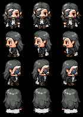

<h1> Morgana Character </h1>
<table>
  <tr>
    <th><b>Face Art</b></th>
    <th><b>Sprites</b></th>
  </tr>
  <td></td>
  <td></td>
</table>
<ul>
<li><b>Nome:</b> Mr Crowley</li>  
<li><b>Idade:</b> 38 anos </b></li>  
<li><b>Gostos:</b> Crowley tem um grande interesse em compreender a natureza e os fenômenos do mundo ao seu redor. </li>  
<li><b>Origem:</b> Desde a infância, Crowley demonstrou um fascínio pelos mistérios do mundo e o desejo de se tornar o mestre da vida, buscando o conhecimento total e o controle absoluto. No entanto, sua vida foi marcada por perdas dolorosas, começando com a morte de sua mãe quando ainda era jovem. Esse evento despertou nele um intenso medo da morte, mas não da sua própria, e sim da morte de seus entes queridos. Depois de perder também seu pai, Crowley foi enviado para um orfanato escolar especializado em alquimia, onde desenvolveu suas habilidades e criou a "Stone of Chronos", uma pedra que ele acreditava ser capaz de dar a imortalidade ao ser humano. Essa pedra, na verdade, manipulava a matéria ao seu redor. Apesar de ser um segredo, Crowley contribuiu significativamente para a alquimia, sendo considerado um gênio quando atingiu a idade de 20 anos. Devido ao seu medo de perder pessoas queridas, ele viveu isolado e distante dos outros, tendo crescido em um orfanato masculino. Sua falta de contato com o sexo oposto e o desejo de encontrar alguém com o mesmo medo da morte o levaram a buscar um companheiro que compartilhasse sua busca por imortalidade.
Na vida adulta, Crowley se tornou um estudioso de alquimia e recebeu treinamento em defesa pessoal para complementar suas pesquisas. Sua vida muda quando conhece Victor, um novato que se torna seu subordinado. A resposta de Victor a uma pergunta de Crowley faz nascer uma forte amizade, que com o tempo se transforma em amor.</li>  
<li><b>Trabalho:</b> Crowley é um alquimista de destaque em sua época.</li>  
<li><b>Personalidade:</b> Reservado e controlado, Crowley raramente demonstra emoções.</li>  
<li><b>Família:</b> Marido de Victor Frankenstein.</li>  
<li><b>Habilidades:</b> Os ataques de Crowley incluem socos revestidos de ar. Ele é capaz de manipular elementos naturais em seu máximo poder.</li>
</ul>
