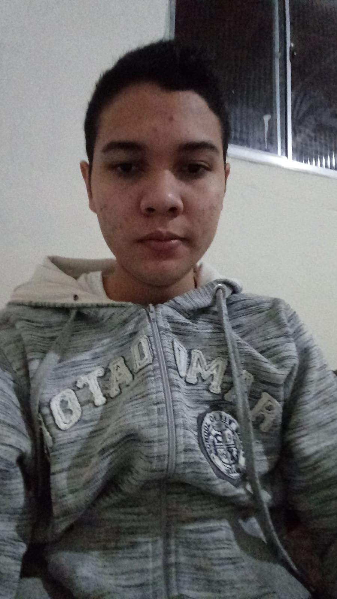

### Fragmentado
---
## ➤ Sinopse do Game:

Um jogo sobre três historias diferentes, ligadas por um local e ao sangue jorrado no mesmo.
Jhonny, um homem que busca resgatar sua esposa. se passando no período de 1800 jhonny é um ex pistoleiro por isso ele tem habilidades com facas e armas, certo dia Jhonny vai a uma viagem com sua esposa jasmin, porém ela acaba sendo sequestrada o que leva Jhonny a entrar em uma floresta e se envolver no caminho de uma estranha Seita, nessa jornada armando com armas de fogo e faca utilizando das mecânica de um rpg por turno o jogado deverá explorar o local, descobri um vilarejo, entender o que é essa seita e principalmente resgatar a esposa de Jhonny, sendo a essa a primeira campanha do jogo.

 

Morgana, a mulher que busca vingança. Se passando no período de 1500 dessa vez o jogador vai viver na pele de Morgana uma mulher que após a chegada de um culto que ao poucos ganhou sua confiança Morgana confiou a Caim o lider do culto a estranha pedra que existia no local, infelizmente Caim ficou fascinado pela a pedra e por conta disso usou seu poderes para matar todos os habitantes do condado incluído a família de Morgana. Dessa vez armado com espada e uma estranha pedra de elementos mágico o jogador deverá andar pelo o mapa de roanoke caçando cada um desses cultistas com o objetivo de se vingar, além disso Morgana também vai arranjar resposta sobre a pedra e sobre o culto.

 

Mr. crowley, um homem que perdeu tudo. Se passando no período de 1200 o jogador irá viver na pele daquele que criou a pedra, nessa história crowley vai perder alguém e isso vai levá-lo a criar a pedra, mas a consequência dessa criação é que em resumo nessa Campanha armado apenas com seus punhos e magia da pedra o jogador deverá matar aquele que um dia crowley tanto amou…

 

Todos eles se vêm em meio a uma trama pessoal, alguns se envolvendo em problemas de uma seita
que surge nesse caos e enquanto um luta por tudo que tem, outros lutam por tudo o que perderam.
Tudo isso graçasao preconceito, ao desejo de ser deus, ao desejo de servir a deus e principalmente
a uma pedra que profana a vida.

---

## ➤ Ferramentas utilizadas

  

  

  
  &nbsp;

  

  
  

  &nbsp;
  
 

 

  &nbsp;

  &nbsp;

 

### ➤ Nosso time:

<table>
 <tr>
  <th> <b> O Chefe </b> </th>
  <th> <b> O Designer </b> </th>
  <th> <b> O Map Designer </b> </th>
  <th> <b> O Programador </b> </th>
 </tr>
 <tr>
  <td>    
 Maxwel Gomes 
</td>
  <td>    
 Gabriel Dext 
</td>
  <td>    
 Antonio Silvestre 
</td>
  <td>    
 Raul Braga 
</td>
 </tr>
</table>

